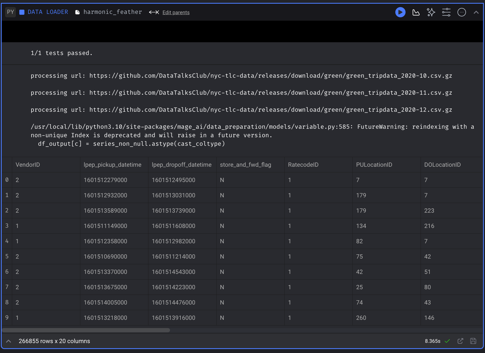
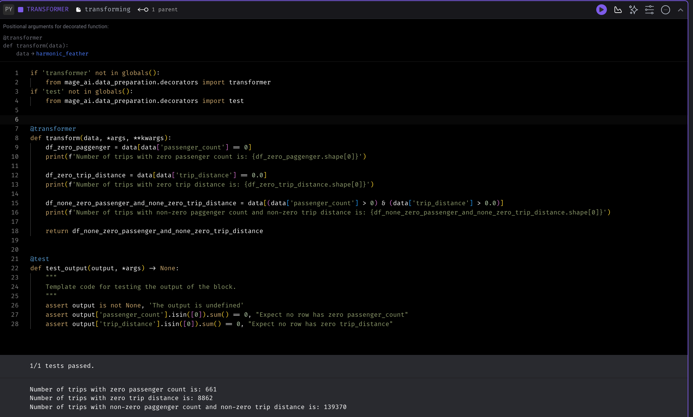
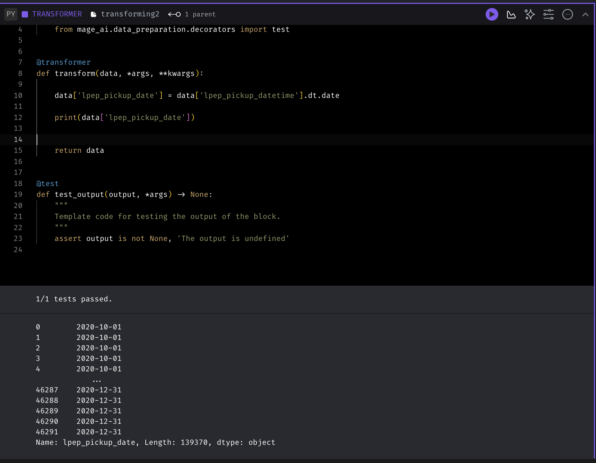
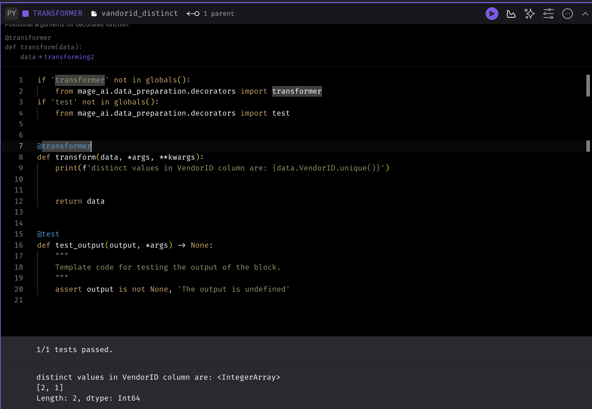
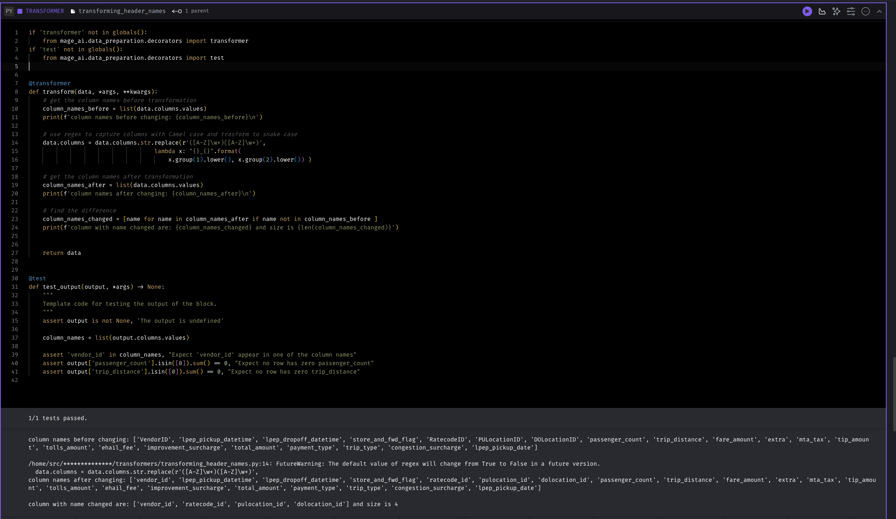
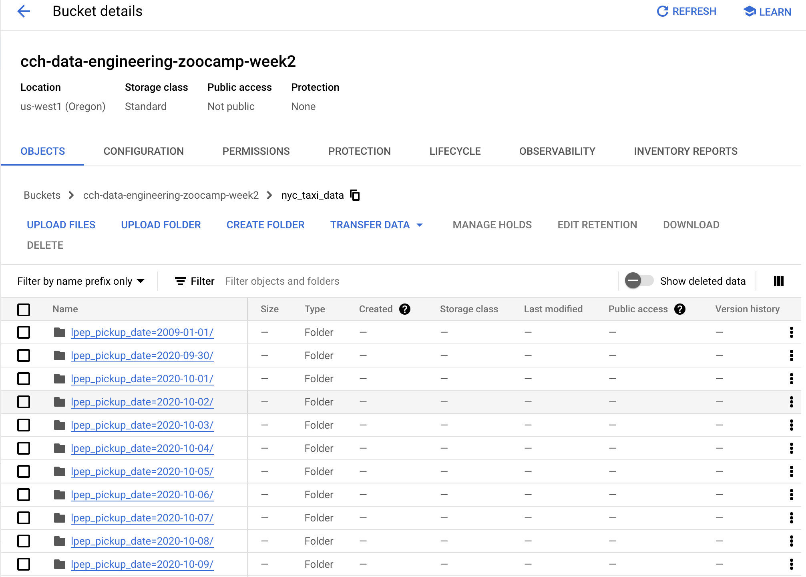

# Week 2 Homework Answers

## Question 1. Data Loading

[answer 1 code](./answer1_code.md)

 

**answer**

266,855 rows x 20 columns

 

## Question 2. Data Transformation

[answer 2 code](./answer2_code.md)

 

**answer**
139,370 rows

 

## Question 3. Data Transformation

[answer 3 code](./answer3_code.md)

 

**answers**

data['lpep_pickup_date'] = data['lpep_pickup_datetime'].dt.date

 

## Question 4. Data Transformation

[answer 4 code](./answer4_code.md)

 

**answer**

1 or 2

 

## Question 5. Data Transformation

[answer 5 code](./answer5_code.md)

 

**answer**

4

 

## Question 6. Data Exporting

[answer 6 code](./answer6_code.md)

 

**answer**

95

Since 95 is not among the values, I am selecting 96 in the answer form

 

