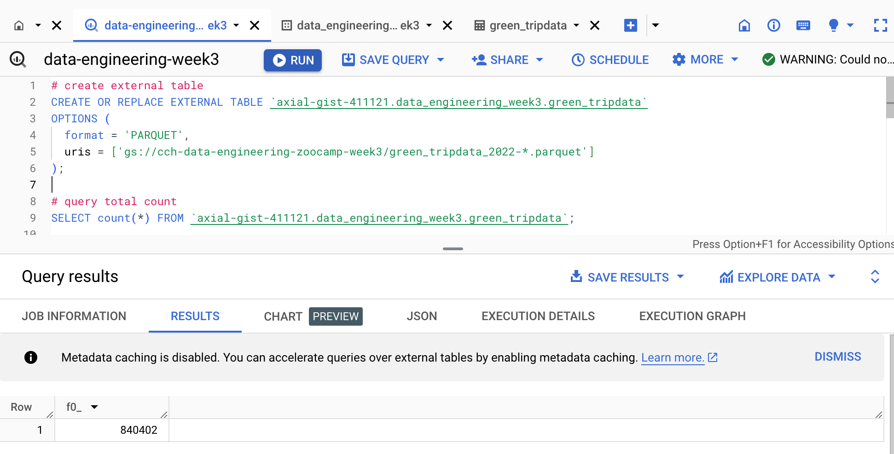
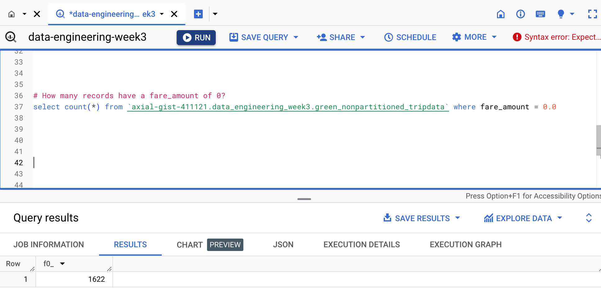
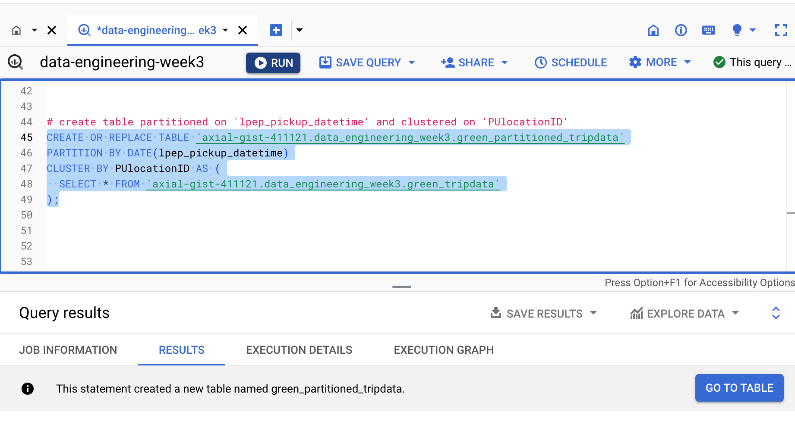
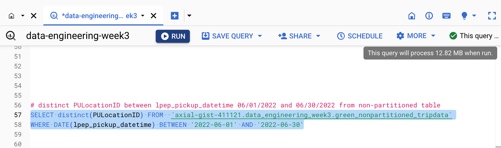
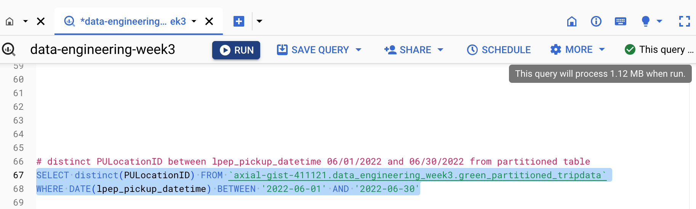

# Question 1: What is count of records for the 2022 Green Taxi Data??

 

 

840,402

 

# Question 2: 

Write a query to count the distinct number of PULocationIDs for the entire dataset on both the tables.
What is the estimated amount of data that will be read when this query is executed on the External Table and the Table?

 

answer: 0 MB for the External Table and 6.41MB for the Materialized Table

 

# Question 3: How many records have a fare_amount of 0?

 

 

1,622

 

# Question 4: 

What is the best strategy to make an optimized table in Big Query if your query will always order the results by PUlocationID and filter based on lpep_pickup_datetime? (Create a new table with this strategy)

 

 

answer: Partition by lpep_pickup_datetime Cluster on PUlocationID

 

# Question 5: 

Write a query to retrieve the distinct PULocationID between lpep_pickup_datetime 06/01/2022 and 06/30/2022 (inclusive)

Use the materialized table you created earlier in your from clause and note the estimated bytes. Now change the table in the from clause to the partitioned table you created for question 4 and note the estimated bytes processed. What are these values?

 

 

 

answer: 12.82 MB for non-partitioned table and 1.12 MB for the partitioned table

 

# Question 6: Where is the data stored in the External Table you created?

GCP Bucket

 

# Question 7: It is best practice in Big Query to always cluster your data:

 

False

 

# Question 8: 
No Points: Write a SELECT count(*) query FROM the materialized table you created. How many bytes does it estimate will be read? Why?

 

answer: 0B because table row count is already part of the table metadata and does not require querying data/

 
