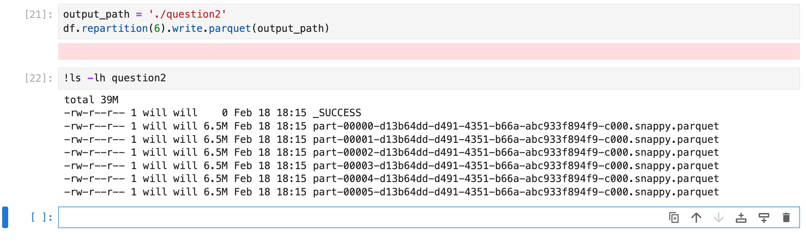

## Question 1

**answer**: 3.5.0  (the current latest version is 3.5.0 if we installed without specifying a particular version)

---

## Question 2

 

**answer**: 6MB

---

## Question 3

**Solution 1**: using spark sql

 

**Solution 2**: using dataframe functions

 

**answer**: 62,610

---

## Question 4

**Solution 1**: using dataframe functions

 

**Solution 2**: using spark sql

 

**answer**: 631,152.50 Hours

---

## Question 5

**answer**: 4040

---

## Question 6

**answer**: Jamaica Bay

---

