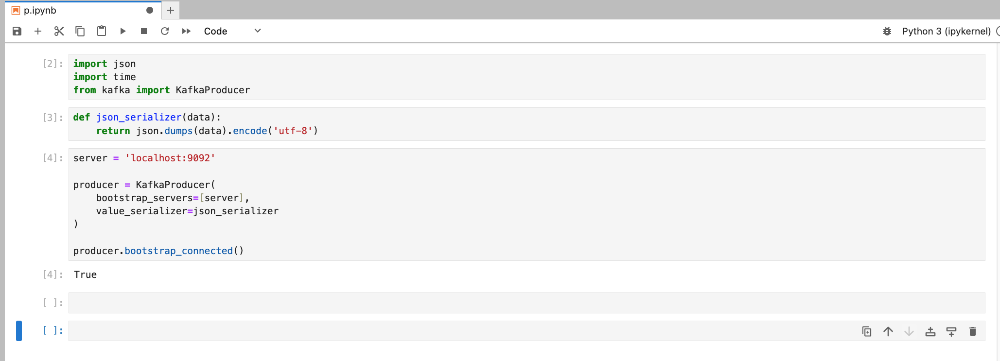
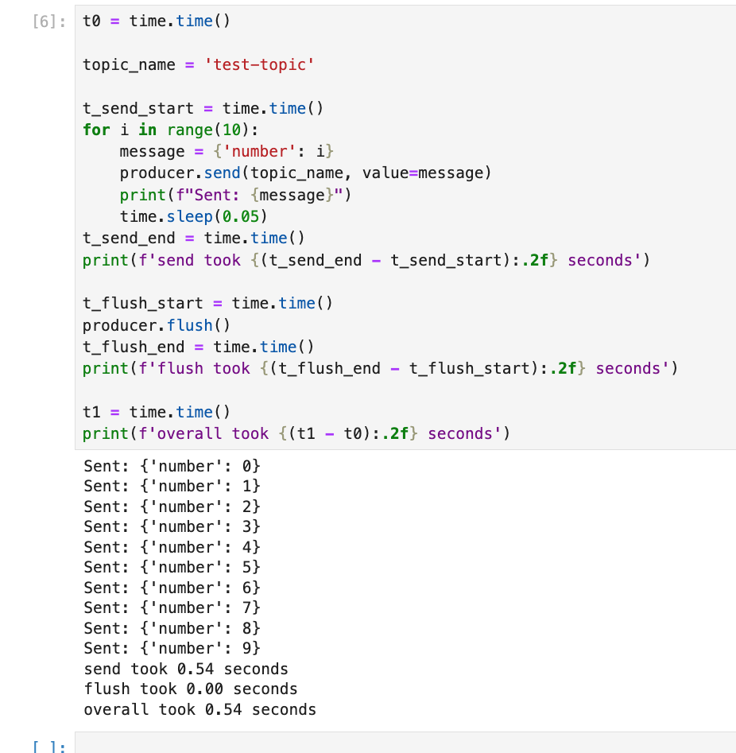
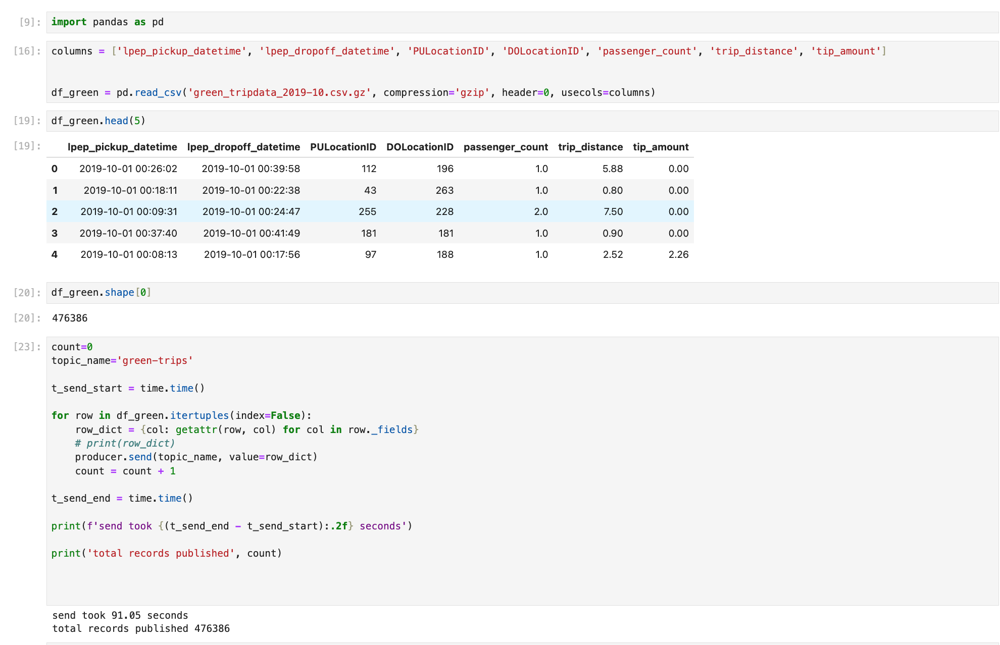
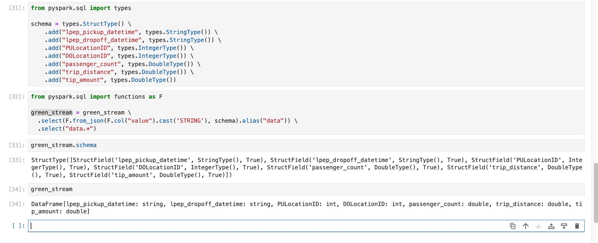
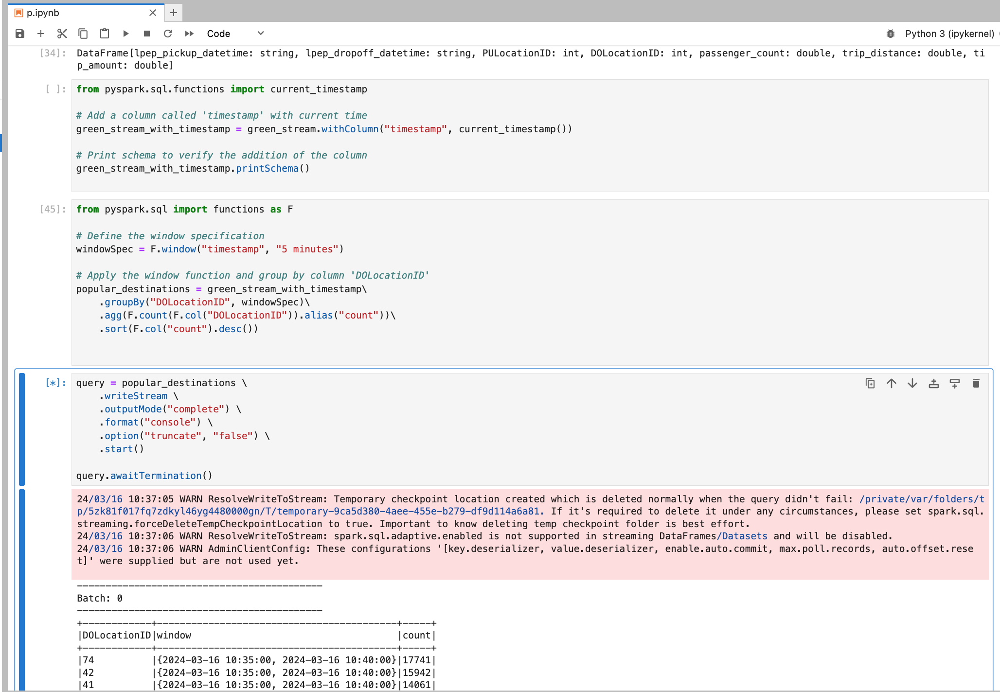

# Module 6

## Question 1

**Answer**

```
v22.3.5 (rev 28b2443)
```

<br>

**Solution**


```
jay@cch-home 06-streaming % docker exec -it redpanda-1 /bin/bash
redpanda@6c668d9a03d7:/$ rpk help
rpk is the Redpanda CLI & toolbox

Usage:
  rpk [command]

Available Commands:
  acl         Manage ACLs and SASL users
  cloud       Interact with Redpanda cloud
  cluster     Interact with a Redpanda cluster
  container   Manage a local container cluster
  debug       Debug the local Redpanda process
  generate    Generate a configuration template for related services
  group       Describe, list, and delete consumer groups and manage their offsets
  help        Help about any command
  iotune      Measure filesystem performance and create IO configuration file
  plugin      List, download, update, and remove rpk plugins
  redpanda    Interact with a local Redpanda process
  topic       Create, delete, produce to and consume from Redpanda topics
  version     Check the current version
  wasm        Deploy and remove inline WASM engine scripts

Flags:
  -h, --help      Help for rpk
  -v, --verbose   Enable verbose logging (default: false)

Use "rpk [command] --help" for more information about a command.


# check version

redpanda@6c668d9a03d7:/$ rpk version
v22.3.5 (rev 28b2443)
```

<br>


## Question 2

**Answer**

```
redpanda@6c668d9a03d7:/$ rpk topic create test-topic
TOPIC       STATUS
test-topic  OK
```

<br>

**Solution**


```
redpanda@6c668d9a03d7:/$ rpk topic create -h
Create topics.

All topics created with this command will have the same number of partitions,
replication factor, and key/value configs.

For example,

	create -c cleanup.policy=compact -r 3 -p 20 foo bar

will create two topics, foo and bar, each with 20 partitions, 3 replicas, and
the cleanup.policy=compact config option set.

Usage:
  rpk topic create [TOPICS...] [flags]

Flags:
  -d, --dry                        Dry run: validate the topic creation request; do not create topics
  -h, --help                       Help for create
  -p, --partitions int32           Number of partitions to create per topic; -1 defaults to the cluster's default_topic_partitions (default -1)
  -r, --replicas int16             Replication factor (must be odd); -1 defaults to the cluster's default_topic_replications (default -1)
  -c, --topic-config stringArray   key=value; Config parameters (repeatable; e.g. -c cleanup.policy=compact)

Global Flags:
      --brokers strings         Comma-separated list of broker ip:port pairs (e.g. --brokers '192.168.78.34:9092,192.168.78.35:9092,192.179.23.54:9092'). Alternatively, you may set the REDPANDA_BROKERS environment variable with the comma-separated list of broker addresses
      --config string           Redpanda config file, if not set the file will be searched for in the default locations
      --password string         SASL password to be used for authentication
      --sasl-mechanism string   The authentication mechanism to use. Supported values: SCRAM-SHA-256, SCRAM-SHA-512
      --tls-cert string         The certificate to be used for TLS authentication with the broker
      --tls-enabled             Enable TLS for the Kafka API (not necessary if specifying custom certs)
      --tls-key string          The certificate key to be used for TLS authentication with the broker
      --tls-truststore string   The truststore to be used for TLS communication with the broker
      --user string             SASL user to be used for authentication
  -v, --verbose                 Enable verbose logging (default: false)


# create the topic

redpanda@6c668d9a03d7:/$ rpk topic create test-topic
TOPIC       STATUS
test-topic  OK


  ```


<br>

## Question 3

**Answer**

```
True
```


<br>

**Solution**




<br>


## Question 4

**Answer**

Since we call `time.sleep` in the for loop, most time is spent on sleeping. Total time is `0.54 sec`

```
Sending the messages
```


<br>


**Solution**




<br>

## Question 5


**Answer**

```
91 sec
```


<br>

**Solution**




<br>

## Question 6


**Answer**

```
DataFrame[lpep_pickup_datetime: string, lpep_dropoff_datetime: string, PULocationID: int, DOLocationID: int, passenger_count: double, trip_distance: double, tip_amount: double]
```

<br>

**Solution**





<br>


## Question 7


**Answer**


```
DOLocationID 71
```


<br>

**Solution**




<br>


